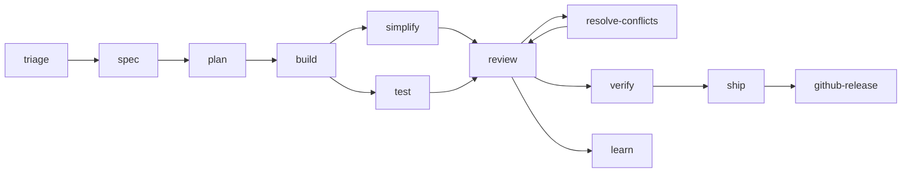

# AI Commands, Skills & Agents

Source of truth for reusable AI agent commands, skills, and agents.
Distributed via `bin/sync` to global and per-project directories.

## Three-Layer Architecture

- **Commands** — human-invoked workflows. Thin orchestrators that route to skills.
  Loaded on demand, not in context. Single `.md` files in `commands/`.
- **Agents** — role-specific personas (code-reviewer, security-auditor, test-engineer).
  Evaluate and report. Orchestration belongs to commands. Single `.md` files in `agents/`.
- **Skills** — agent and/or human invoked. Description preloaded in context for
  auto-activation. Directories under `skills/` with `SKILL.md` + optional `references/`.

## Quick Start

```bash
# 1. Create your local config (gitignored)
cp sync.example.toml sync.toml

# 2. Edit sync.toml to match your setup
#    - Set global target directories
#    - List the commands/skills/agents you want globally
#    - Define any per-project installs

# 3. Run the sync script
bin/sync              # install/update
bin/sync --dry-run    # preview
bin/sync --clean      # remove stale symlinks
```

## Command Workflow

Commands are ordered by where they fit in the software development lifecycle.



### Phase 1 — Specify

| Command | Description |
|---------|-------------|
| `spec` | Start spec-driven development — write a structured specification before code |
| `triage` | Triage GitHub issues via an autonomous label-based state machine |

### Phase 2 — Plan

| Command | Description |
|---------|-------------|
| `plan` | Break work into small, atomic, verifiable tasks; or produce a full PRD |

### Phase 3 — Build

| Command | Description |
|---------|-------------|
| `build` | Implement tasks incrementally — build one thin slice at a time with TDD |
| `test` | Run TDD workflow — write tests to prove behaviour |
| `simplify` | Simplify code — remove unnecessary complexity while preserving behaviour |

### Phase 4 — Review

| Command | Description |
|---------|-------------|
| `review` | Two-lens PR review — code review then security audit |
| `resolve-conflicts` | Merge origin/main into the current branch and resolve all conflicts |
| `learn` | Extract non-obvious lessons from the current session |

### Phase 5 — Ship

| Command | Description |
|---------|-------------|
| `verify` | Runtime-verify a PR by booting the dev server and driving the UI via Chrome DevTools MCP |
| `ship` | Ship to production — pre-launch checklist, parallel persona fan-out, staged rollout |
| `github-release` | Determine semver, write release notes, create tag |

## Available Agents

3 agents in `agents/`:

| Agent | Description |
|-------|-------------|
| `code-reviewer` | Five-axis code review (correctness, readability, architecture, security, performance) |
| `security-auditor` | Threat-model-focused security review (OWASP, STRIDE, LLM Top 10) |
| `test-engineer` | Test coverage analysis, test design, Prove-It pattern for bugs |

Agents are `mode: subagent` — invoked by commands or `@`-mentions, not Tab-switchable as primary agents.

## Available Skills

30 skills in `skills/`:

### General Purpose (install globally)

| Skill | Description |
|-------|-------------|
| `architecture-review` | Surface architectural friction as GitHub issues |
| `browser-testing-with-devtools` | Debug browser UI via chrome-devtools MCP |
| `code-review-and-quality` | Five-axis PR review, exposure × impact severity, AC coverage, `## Automated review` comment (used by /review in human and CI mode) |
| `code-simplification` | Remove unnecessary complexity in the codebase |
| `context-engineering` | Discover and hierarchically load project context |
| `debugging-and-error-recovery` | Systematic root-cause debugging |
| `deprecation-and-migration` | Safely deprecate systems and migrate users |
| `documentation-and-adrs` | Write ADRs, comment the why, maintain docs |
| `doubt-driven-development` | Adversarial self-review for high-stakes changes |
| `frontend-ui-engineering` | Production-quality UI: components, state, accessibility |
| `git-workflow-and-versioning` | Trunk-based development, atomic commits, worktrees |
| `incremental-implementation` | Implement planned tasks slice-by-slice with TDD |
| `interview-me` | One-question-at-a-time interviewing to clarify underspecified asks |
| `learn-from-session` | Extract non-obvious lessons to AGENTS.md or skill files |
| `observability-and-instrumentation` | Structured logs, RED metrics, alert on symptoms |
| `performance-optimization` | Measure-first performance optimization |
| `planning-and-task-breakdown` | Decompose specs into thin vertical slices |
| `quality-gate` | Run lint + typecheck + test + build, stop-the-line on failure |
| `security-and-hardening` | Threat-model-first security controls |
| `shipping-and-launch` | Pre-launch checklist, staged rollout, rollback readiness |
| `source-driven-development` | Fetch and cite official docs instead of hallucinating |
| `spec-driven-development` | Write a structured specification before writing code |
| `test-driven-development` | RED → GREEN → REFACTOR TDD workflow |
| `writing-humanizer` | Remove signs of AI-generated writing from text |

### Project-Specific (install per-project)

| Skill | Description |
|-------|-------------|
| `content-editor` | Autonomous content pipeline: queue, ingest, write, quality gates, publish |
| `standards-api` | RESTful API design conventions and best practices |
| `standards-laravel` | Laravel backend conventions |
| `standards-nextjs` | Next.js 15 App Router project conventions |
| `standards-php` | PHP 8.3+ best practices: DTOs, Value Objects, exceptions |
| `standards-typescript` | TypeScript project conventions |

## Adding a New Command

Create `commands/<name>.md` with frontmatter:

```yaml
---
description: What this command does, when to use it.
---
```

Then add the name to `sync.toml` under `[global] commands = [...]`.

## Adding a New Agent

Create `agents/<name>.md` with frontmatter:

```yaml
---
name: <name>
description: Role description — when to use.
mode: subagent
permission:
  edit: deny
  bash: deny
---
```

Then add the name to `sync.toml` under `[global] agents = [...]`.

## Adding a New Skill

Create `skills/<name>/SKILL.md` with frontmatter (must start with "Use when..."):

```yaml
---
name: <name>
description: Use when ... (trigger conditions)
---
```

Then add the name to `sync.toml` under `[global] skills = [...]` (general purpose)
or under a `[[project]]` (project-specific).

See the Skill Authoring Rules in `AGENTS.md` for the full body template
(Core Workflow → Common Rationalizations → Red Flags → Verification → Constraints → Reference Guide).

## Distribution

Target directories (per opencode's discovery rules):

| Resource | Global | Per-Project |
|----------|--------|-------------|
| Commands | `~/.config/opencode/commands/` | `<project>/.opencode/commands/` |
| Skills | `~/.config/opencode/skills/` and `~/.agents/skills/` | `<project>/.agents/skills/` |
| Agents | `~/.config/opencode/agents/` | `<project>/.opencode/agents/` |

See `sync.example.toml` for the full config format with inline documentation.