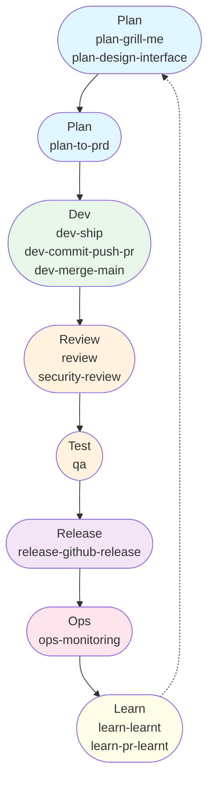

# Development Workflow

A linear SDLC map showing which skills to invoke at each stage. Skills are prefixed by stage so you can see *when* to use them at a glance.

## 1. Plan — Idea & Discovery

Description: Stress-test the initial concept and generate UI/UX designs.
AFK: No
Skills:
  - `plan-grill-me` — Interview the user relentlessly about the plan until shared understanding
  - `plan-design-interface` — Generate UI/UX designs from requirements
Context: User's initial idea or concept

## 2. Plan — PRD to Issues

Description: Define goals, features, specs, and break down into vertical-sliced GitHub issues.
AFK: No
Skills:
  - `plan-to-prd` — Turn an idea into a parent PRD plus vertical-sliced GitHub issues
Context: Outcome of grill me, research, and prototyping

## 3. Dev — Implementation

Description: Write code, run tests, open PRs, and merge to main.
AFK: Yes
Skills:
  - `dev-ship` — Pick the next ready issue, implement with TDD, run quality gate, open PR
  - `dev-commit-push-pr` — Commit, push, and open a pull request
  - `dev-merge-main` — Merge origin/main into the current branch and resolve conflicts
Context: GitHub issue

## 4. Review — Code Review

Description: Automated code and security review on open PRs.
AFK: Yes
Skills:
  - `review` — Code review checklists for backend and frontend
  - `security-review` — Security auditing and secure coding practices review
Context: Open PR

## 5. Test — QA / Testing

Description: Validate requirements and functionality.
AFK: No
Skills:
  - `qa` — Validate requirements and function against acceptance criteria
Context: GitHub PR

## 6. Release — Deployment

Description: Release to users and tag versions.
AFK: Yes
Skills:
  - `release-github-release` — GitHub release automation with changelog and version tagging
Context: Merged PR to main

## 7. Ops — Monitoring & Maintenance

Description: Maintain and observe post-launch.
AFK: Yes
Skills:
  - `ops-monitoring` — Observability, metrics, structured logging, and alerting review
Context: Log data, monitoring dashboards

## 8. Learn — Retrospective

Description: Extract lessons from sessions and your own PRs so Claude gets smarter over time.
AFK: Yes / No
Skills:
  - `learn-learnt` — Sweep recent session transcripts and distil lessons into skills and CLAUDE.md
  - `learn-pr-learnt` — Review your own PRs from the last 7 days and extract learnings
Context: Recent session transcripts / GitHub PRs you've authored

---

## Workflow Diagram

