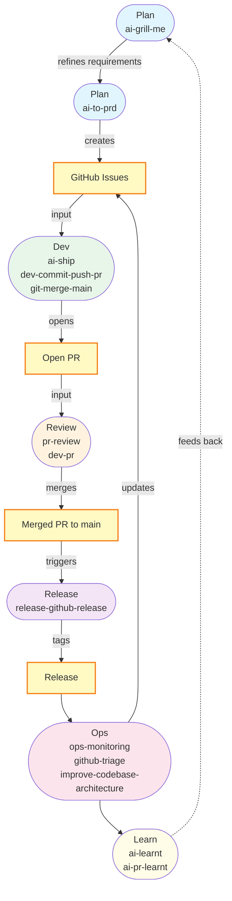

# Development Workflow

A linear SDLC map showing which skills to invoke at each stage. Skills are prefixed by stage so you can see *when* to use them at a glance.

## 1. Plan — Idea & Discovery

Description: Stress-test the initial concept until shared understanding.
AFK: No
Skills:
  - `ai-grill-me` — Interview the user relentlessly about the plan until shared understanding
Context: User's initial idea or concept
Output: Refined requirements and shared understanding

## 2. Plan — PRD to Issues

Description: Define goals, features, specs, and break down into vertical-sliced GitHub issues.
AFK: No
Skills:
  - `ai-to-prd` — Turn an idea into a parent PRD plus vertical-sliced GitHub issues
Context: Outcome of grill me, research, and prototyping
Output: GitHub issues

## 3. Dev — Implementation

Description: Write code, run tests, open PRs, and merge to main.
AFK: Yes
Skills:
  - `ai-ship` — Pick the next ready issue, implement with TDD, run quality gate, open PR
  - `dev-commit-push-pr` — Commit, push, and open a pull request
  - `git-merge-main` — Merge origin/main into the current branch and resolve conflicts
Context: GitHub issue
Output: Open PR

## 4. PR Review — Code Review & Resolution

Description: Validate requirements and functionality, action feedback.
AFK: No
Skills:
  - `pr-review` — Code review checklists for backend and frontend
  - `dev-pr` — Action PR review feedback, resolve merge conflicts, fix CI issues
Context: Open PR
Output: Merged PR to main

## 5. Release — Deployment

Description: Release to users and tag versions.
AFK: Yes
Skills:
  - `release-github-release` — GitHub release automation with changelog and version tagging
Context: Merged PR to main
Output: Tagged release

## 6. Ops — Monitoring & Maintenance

Description: Maintain and observe post-launch.
AFK: Yes
Skills:
  - `ops-monitoring` — Observability, metrics, structured logging, and alerting review
  - `github-triage` — Triage GitHub issues through a label-based state machine
  - `improve-codebase-architecture` — Surface architectural friction and propose refactors
Context: Log data, monitoring dashboards, GitHub issues
Output: Updated issues, refactor proposals

## 7. Learn — Retrospective

Description: Extract lessons from sessions and your own PRs so Claude gets smarter over time.
AFK: Yes / No
Skills:
  - `ai-learnt` — Sweep recent session transcripts and distil lessons into skills and AGENTS.md
  - `ai-pr-learnt` — Review your own PRs from the last 7 days and extract learnings
Context: Recent session transcripts / GitHub PRs you've authored
Output: Updated skills and conventions

---

## Workflow Diagram

