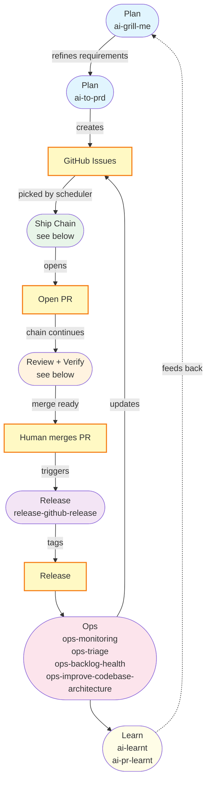
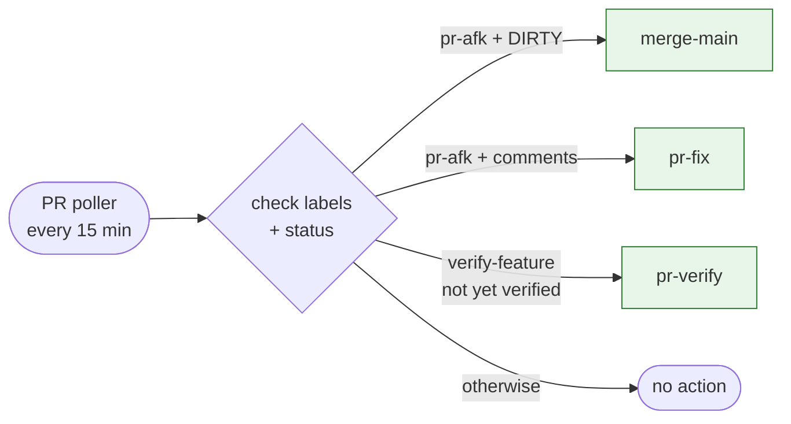

# Development Workflow

A linear SDLC map showing which skills to invoke at each stage. Skills are prefixed by stage so you can see *when* to use them at a glance.

## 1. Plan — Idea & Discovery

Description: Stress-test the initial concept until shared understanding.
AFK: No
Skills:
  - `ai-grill-me` — Interview the user relentlessly about the plan until shared understanding
Context: User's initial idea or concept
Output: Refined requirements and shared understanding

## 2. Plan — PRD to Issues

Description: Define goals, features, specs, and break down into vertical-sliced GitHub issues.
AFK: No
Skills:
  - `ai-to-prd` — Turn an idea into a parent PRD plus vertical-sliced GitHub issues
Context: Outcome of grill me, research, and prototyping
Output: GitHub issues

## 3. Dev — Implementation (chain steps 1–4)

Description: Write code with TDD, run the quality gate, simplify.
AFK: Yes (run by the agent-orchestration scheduler as a chain)
Skills:
  - `dev-implement` — Implement one issue with TDD on a pre-prepared branch
  - `quality-gate` — Lint + types + tests + build, Stop-the-Line policy
  - `dev-simplify` — Cleanup pass over recently changed code
  - `dev-commit-push-pr` — Commit, push, and open a pull request (ad-hoc human use)
Context: GitHub issue, pre-prepared worktree from supervisor
Output: Branch with code + tests, pushed but no PR yet

## 4. PR Review — Open, Review, Verify (chain steps 5–9)

Description: Open the PR, run code + security review with fresh context, runtime-verify the feature.
AFK: Yes (continued chain run)
Skills:
  - `pr-open` — Open the PR for the pushed branch and transition labels
  - `pr-review` — Read PR diff in fresh context, action review findings, commit, push
  - `quality-gate` — Re-run after review fixes
  - `pr-security-review` — Security-focused review pass with the same shape
  - `pr-verify` — Boot dev server, drive UI via Chrome DevTools MCP, post screenshot summary
  - `pr-fix` — Action external review feedback / CI failures (label-driven via `pr-afk`)
  - `merge-main` — Resolve merge conflicts (label-driven via `pr-afk` + DIRTY)
Context: Pushed branch, linked issue
Output: PR ready for human merge

## 5. Release — Deployment

Description: Release to users and tag versions.
AFK: Yes
Skills:
  - `release-github-release` — GitHub release automation with changelog and version tagging
Context: Merged PR to main
Output: Tagged release

## 6. Ops — Monitoring & Maintenance

Description: Maintain and observe post-launch.
AFK: Yes
Skills:
  - `ops-monitoring` — Observability, metrics, structured logging, and alerting review
  - `ops-triage` — Triage GitHub issues through a label-based state machine
  - `ops-improve-codebase-architecture` — Surface architectural friction and propose refactors
Context: Log data, monitoring dashboards, GitHub issues
Output: Updated issues, refactor proposals

## 7. Learn — Retrospective

Description: Extract lessons from sessions and your own PRs so Claude gets smarter over time.
AFK: Yes / No
Skills:
  - `ai-learnt` — Sweep recent session transcripts and distil lessons into skills and AGENTS.md
  - `ai-pr-learnt` — Review your own PRs from the last 7 days and extract learnings
Context: Recent session transcripts / GitHub PRs you've authored
Output: Updated skills and conventions

---

## Workflow Diagram — high level

## Ship Chain — per-issue, AFK (driven by agent-orchestration scheduler)

Each step runs as its own opencode invocation with fresh context. State passes through prompt envelope (`{issue, branch, pr}`) + a shared worktree.

```mermaid
flowchart LR
    Start([Issue picked<br/>by scheduler]) --> S1
    S1[dev-implement] --> S2[quality-gate]
    S2 --> S3[dev-simplify]
    S3 --> S4[quality-gate]
    S4 --> S5[pr-open]
    S5 --> S6[pr-review]
    S6 --> S7[quality-gate]
    S7 --> S8[pr-security-review]
    S8 --> S9[pr-verify]
    S9 --> Done([Chain done<br/>issue → in-review])

    classDef step fill:#e8f5e9,stroke:#2e7d32
    classDef gate fill:#fff3e0,stroke:#e65100
    class S1,S3,S5,S6,S8,S9 step
    class S2,S4,S7 gate
```

## PR Watch — label-driven, single-shot (continuous)

Polls open PRs and routes to a single skill based on label + state. Skips PRs with an active ship-chain.

